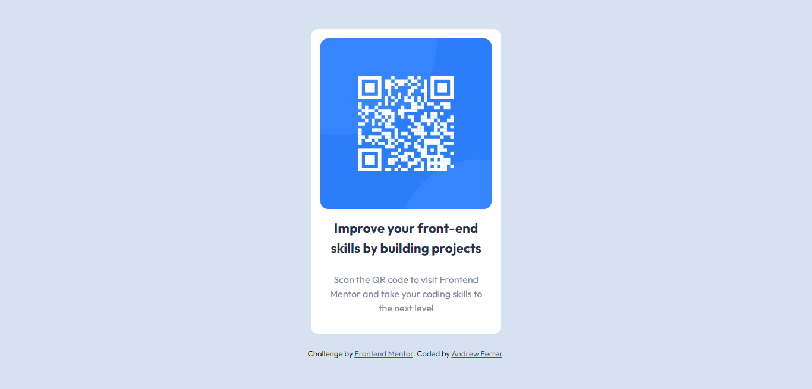

# Frontend Mentor - QR code component solution

This is a solution to the [QR code component challenge on Frontend Mentor](https://www.frontendmentor.io/challenges/qr-code-component-iux_sIO_H). Frontend Mentor challenges help you improve your coding skills by building realistic projects.

## Table of contents

- [Overview](#overview)
  - [Screenshot](#screenshot)
  - [Links](#links)
- [My process](#my-process)
  - [Built with](#built-with)
  - [What I learned](#what-i-learned)
  - [Continued development](#continued-development)
  - [Useful resources](#useful-resources)
- [Author](#author)
- [Acknowledgments](#acknowledgments)

## Overview

### Screenshot

### Links

- Solution URL: [Solution URL here](https://www.frontendmentor.io/solutions/qr-code-component-17IaibGB10)
- Live Site URL: [Live site URL here](https://andrewferrer-frontend-mentor2.netlify.app/)

## My process

### Built with

- Semantic HTML5 markup
- CSS custom properties
- Flexbox
- CSS Grid
- Mobile-first workflow
- rem and em units

### What I learned

What I learned on this challenge is how can I use the rem and em units to set the `font-size` `padding` `margin` and even the `width` of the div. I also follow the semantic format for the better structure in my document such `main` and `footer`.

### Continued development

I've been coding for a years and I stopped for 4 months, I discovered this website to help me recap my knowledge and skills so I will continue to finish the challenges from Newbie to Advanced until I get a job.

### Useful resources

- [Learn CSS Units In 8 Minutes by Web Dev Simplified](https://www.youtube.com/watch?v=-GR52czEd-0)
- [Are you using the right CSS units? by Kevin Powell](https://www.youtube.com/watch?v=N5wpD9Ov_To)
- [The Difference Between Rem Em and Px CSS | When to use which? (Understanding PX Em Rem Elementor) by Tristan Parker](https://www.youtube.com/watch?v=G_V53syo2QQ)

Those links helped me understand the difference of each units existing in CSS.

## Author

- GitHub - [@AndrewFerrer000](https://github.com/AndrewFerrer000)
- Frontend Mentor - [@AndrewFerrer000](https://www.frontendmentor.io/profile/AndrewFerrer000)

## Acknowledgments

Thanks to [Tristan Parker](https://www.youtube.com/@tristanparker), [Kevin Powell](https://www.youtube.com/@KevinPowell) and [Web Dev Simplified](https://www.youtube.com/@WebDevSimplified)
